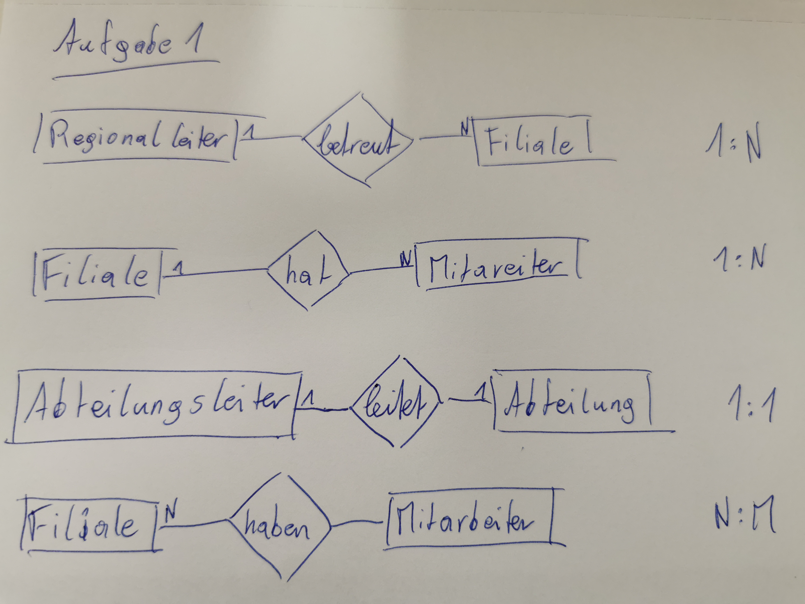
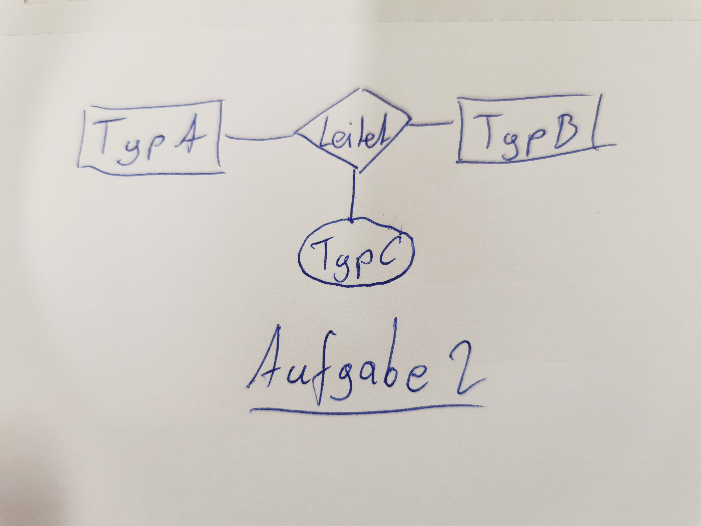
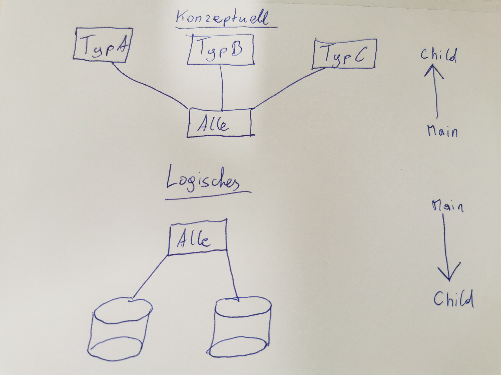
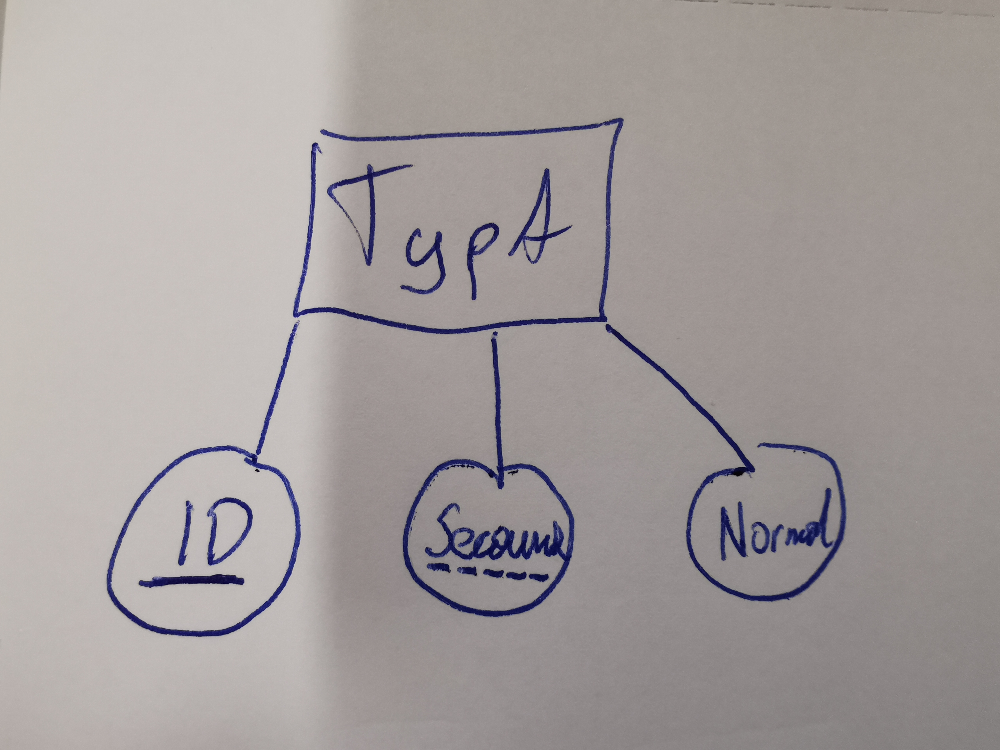
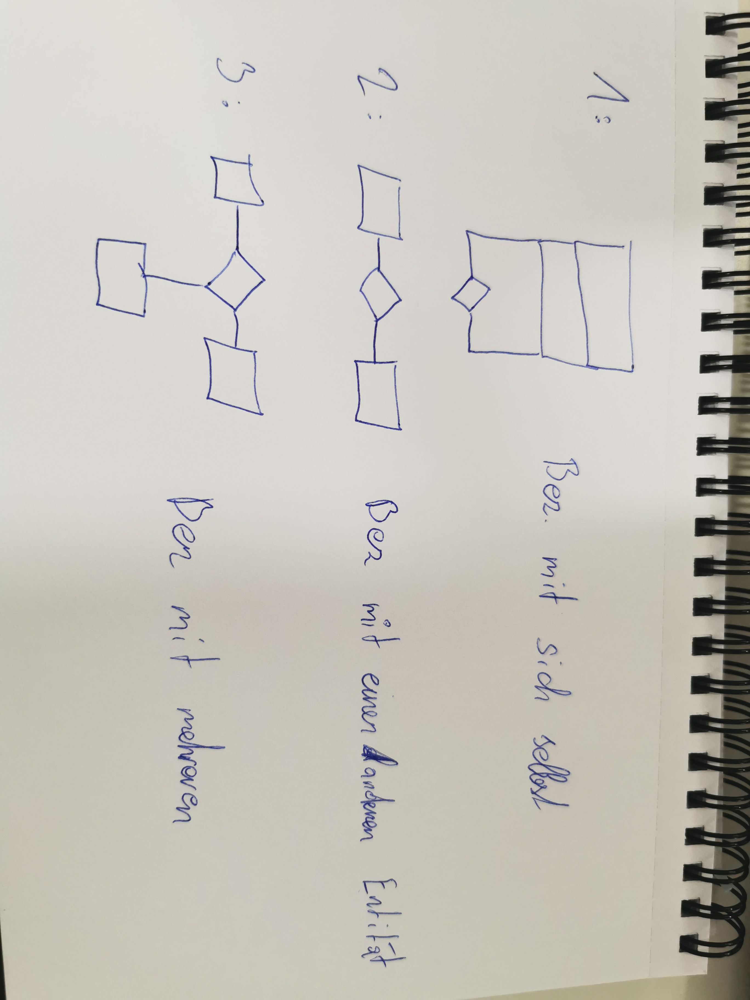
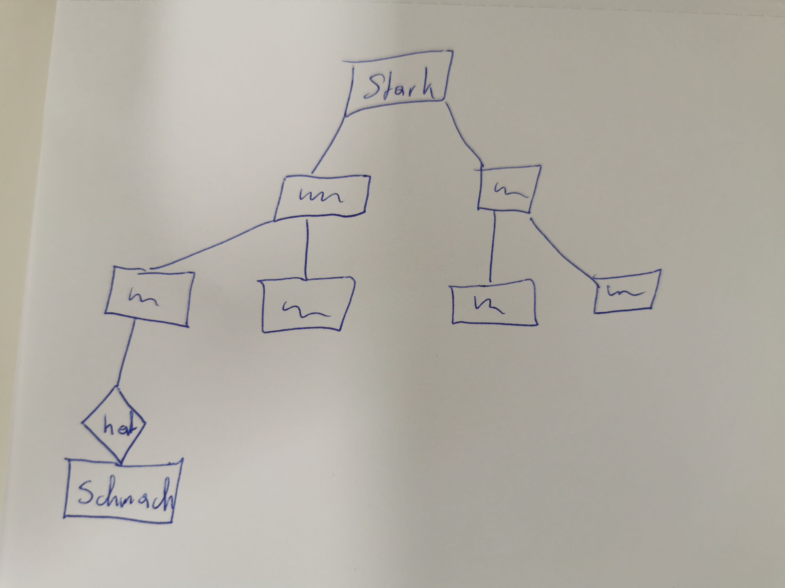
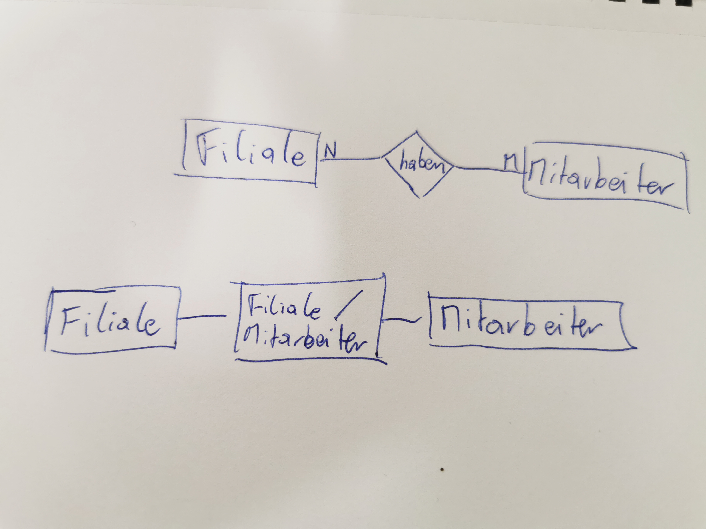
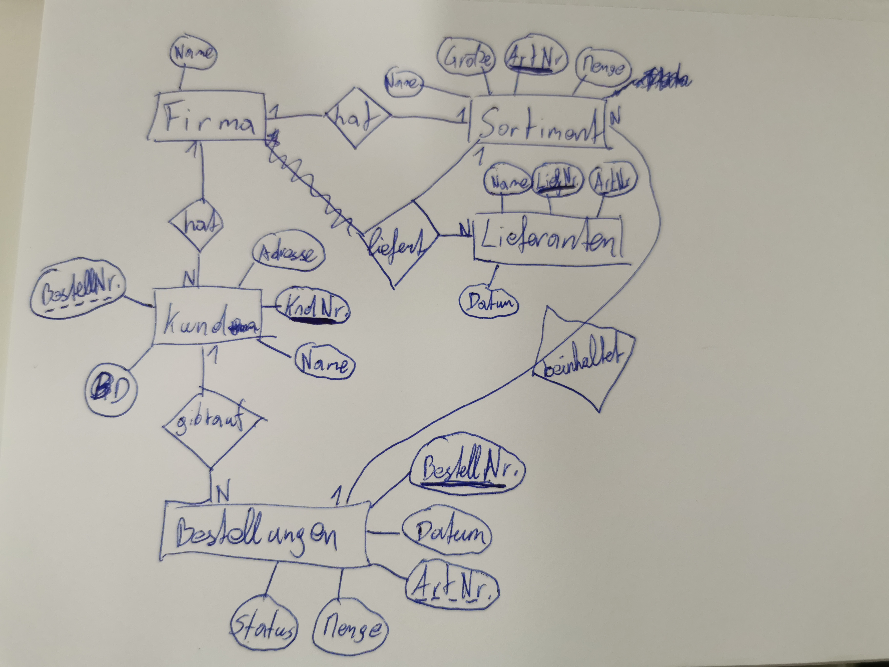
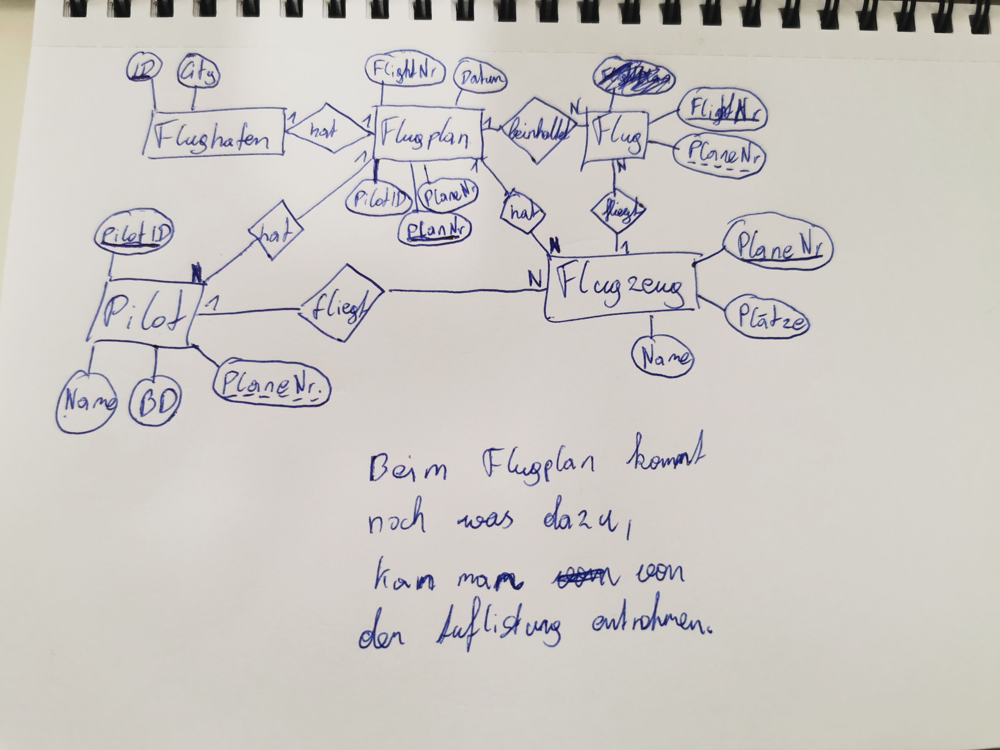

# Erster Test

## Aufgabe 1

## Aufgabe 2

## Aufgabe 3

Benutzersichten, Integritätssicherung, Zugriffskontrolle, Transaktion, Synchronisation

## Aufgabe 4

## Aufgabe 5

## Aufgabe 6

int, char, varchar, date, time

## Aufgabe 7

Primary (Hauptschlüssel), Secondary (Geteilter Key), Normal (einfacher Key)

## Aufgabe 8

## Aufgabe 9

Kardinalität bezeichnet mit wie viel eine Ent. eine bez. führt. Beispiel in Bild 1

1:1 (logisch), 1:N (eins zu mehr), N:M (mehr zu mehr)

## Aufgabe 10

Datenintegrität: Bereichsintegrität & Entitätsintegrität.

Integrität schützt vor nicht berechtigtem Zugriff.

Bei einer referentiellen Integrität müssen Primärschlüssel-Fremdschlüssel-Beziehungen intakt sein.

## Aufgabe 11

Bei den Normalformen wird normalisiert und folgends aufgelistet: 1NF, 2NF, 3NF

Der Unterschied ist der Normalisierungsprozess. Wobei z.B N:M aufgelöst wird zu 1:N, dies wäre die 3NF.

## Aufgabe 12

Eine starke Entität ist eine welche weiter oben richtung Main/Root liegt und eine schwache eine welche z.B. mit "hat" verbunden wird da es ohne dieser nicht geht oder nicht aufgelöst werden kann.

## Aufgabe 13

Objektrelationale, Objektorientierte, Semistrukturierte, Netzwerkartige

## Aufgabe 14

Mit einer Assoziation Tabelle oder wie die auch immer heißt, sprich ich löse die M:N aus zu 2x 1:N.

## Aufgabe 15

Firma (Name: varchar)

Soritment (ArtNr: int, Name: varchar, Größe: int, Menge: int)

Lieferant (LiefNr: int, ArtNr: int, Name: varchar, Datum: date)

Kunden (KndNr: int, BestellNr: int, Name: varchar, BD: date, Adresse: varchar)

Bestellung (BestellNr: int, ArtNR: int, Datum: date, Menge: int, Status: varchar)

## Aufgabe 16

Insert, Update & Delete.

Einfügen, Aktuallisieren & Löschen.

## Aufgabe 17

Flughaben (ID: varchar, City: varchar)

Flugplan (PlanNr: int, PilotID: int, PlaneNr: varchar, FlightNr: int, Abflugdatum: date, Abflugtime: time, Ankunftsdatum: date, Ankunftszeit: time, Abflugflughaben: varchar, Ankunftsflughafen: varchar)

Flug (FlightNr: varchar, PlaneNr: varchar)

Flugzeug (PlaneNr: varchar, Plätze: int, Name: varchar)

Pilot (PilotID: int, PlaneNr: varchar, BD: date, Name: varchar)

